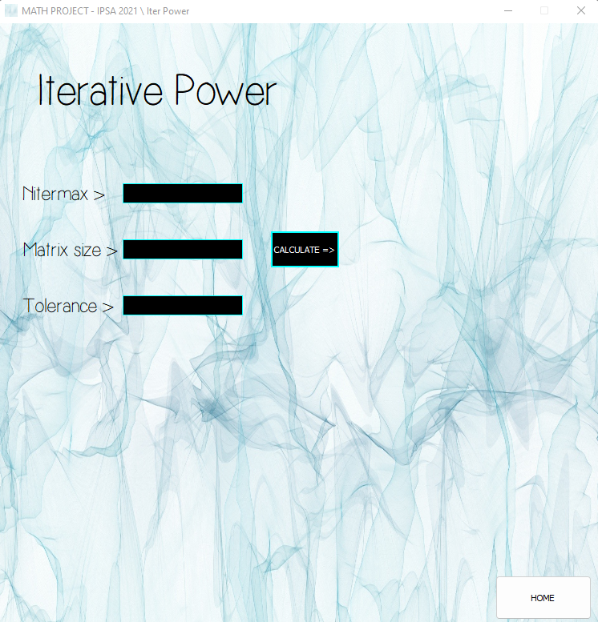

<h2 align="center"> 
  | Simple Math App |
</h2>

[![Contributors][contributors-shield]][contributors-url]
[![Issues][issues-shield]][issues-url]

## Overview:
This math project using Numpy and PyQt5 is a simple made application
to calculate math functions such as the Iterative Power function.

### Options

> Iterative Power
> Inverse Power

### Built With

* [Python](https://www.python.org)
* [PyQt5](https://pypi.org/project/PyQt5/)

> Project Link: [https://github.com/PhantHive/math_project](https://github.com/PhantHive/math_project/)

<!-- MARKDOWN LINKS & IMAGES -->
[contributors-shield]: https://img.shields.io/github/contributors/PhantHive/math_project.svg?style=for-the-badge
[contributors-url]: https://github.com/PhantHive/math_project/graphs/contributors/

[issues-shield]: https://img.shields.io/github/issues/PhantHive/math_project.svg?style=for-the-badge
[issues-url]: https://github.com/PhantHive/math_project/issues/